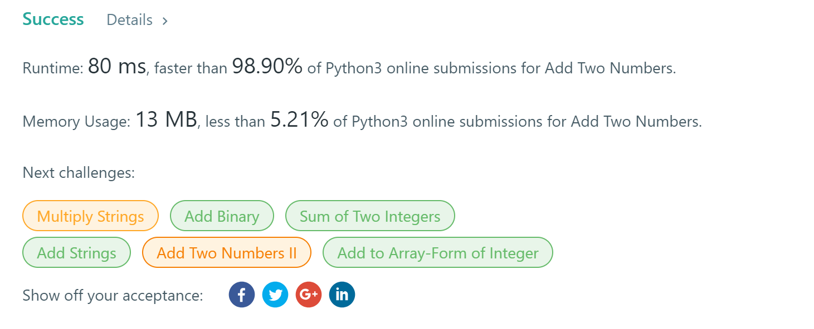

# leetcode
在这里记录leetcode的解题过程。

## 2.Add Two Numbers
**medium**

代码还是不够熟练！看到类竟然不知道怎么去弄了，需要看别人的代码才能实现这样的题目！


You are given two non-empty linked lists representing two non-negative integers. The digits are stored in reverse order and each of their nodes contain a single digit. Add the two numbers and return it as a linked list.

You may assume the two numbers do not contain any leading zero, except the number 0 itself.

Example:
```
Input: (2 -> 4 -> 3) + (5 -> 6 -> 4)
Output: 7 -> 0 -> 8
Explanation: 342 + 465 = 807.
```
### 解法
#### 一种偷懒的做法
先求和，再构建链表
```python
def addTwoNumbers(self, l1: ListNode, l2: ListNode) -> ListNode:
        num1=''
        num2=''
        while l1:
            num1+=str(l1.val)
            l1=l1.next
        while l2:
            num2+=str(l2.val)
            l2=l2.next
        add=str(int(num1[::-1])+int(num2[::-1]))
        add=add[::-1]
        head=ListNode(add[0])
        answer=head
        for i in range(1,len(add)):
            node=ListNode(add[i])
            head.next=node
            head=head.next
        return answer

```
效果还不错：




length=len(s)
    count=0
    max1=0
    for i in range(1,length):
        if s[i]==s[i-1]:
            count=1
        else:
            count+=1
            if count>max1:
                max1=count
    return max1


def lengthOfLongestSubstring(s: str) -> int:
    length = len(s)
    before = []
    countlist = []
    count = 0
    max1 = 0
    for i in s:
        if i not in before:
            count += 1
            if count > max1:
                max1 = count
            before.append(i)
        else:
            count = 1

    return max1